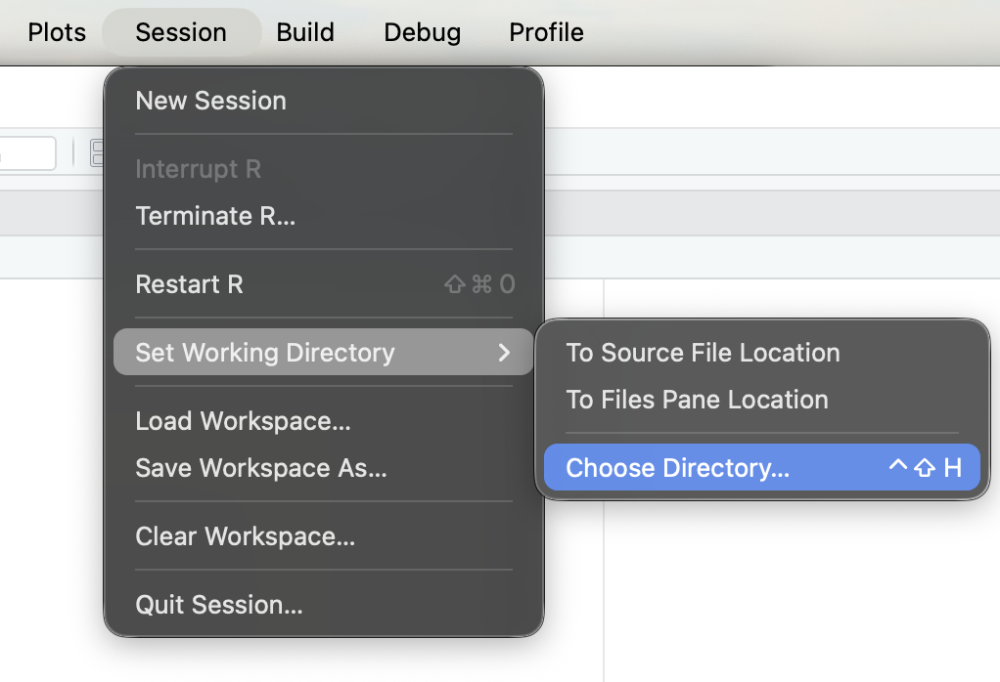

# Introduction to R {.appendix}

R is a free computing software that was designed for statistical computing. To download R, click here for [windows](https://cran.r-project.org/bin/windows/base/) and here for [macOS](https://cran.r-project.org/bin/macosx/). After that is done downloading we should download a code editing software to make coding easier. The most widely used code editor for R is RStudio. To download RStudio click on [here](https://posit.co/download/rstudio-desktop/) and scroll down to step number 2 and select your version from the drop down menu and click download RStudio Desktop. Once the download is done navigate to RStudio on your device and open it.

Now that RStudio is opened on your device click on the button in the top left to open an R Script. This is where you are able to write R programs. Lets start by making a running some code. In the R Script type or copy this code.

```{r}
x <- "hello"
print(x)
```

In the first line of code "x" is called a variable where it gets assigned a value of "hello" by using "\<-" to assign that value. The next line uses a function called print followed by (). The print function will display the value of the variable inside of the function where in this example it is printing the value "hello" of the variable x. This function prints "hello" down in the console below.

R is full of very useful packages that can be used to do so many different things. Below is some code on how to install and load packages that we will be using in R.

```{r, message=FALSE, warning=FALSE}
#install.packages("tidyverse")
library(tidyverse)
```

To install packages you can type `install.packages()` with the package you want inside of the parentheses with " " around the package. You only need to do this once. To load the package onto your R you type `library()` with the package inside of it without " ".

The package we just loaded into R is one that we will be using when we are working with splines on data.

The last little bit of beginning code needed to go over is to read in a csv file. Using csv files are the main file type used to read data into R. When you find a csv data set that you want to use to work with splines create a folder to keep that data set. In the menu bar on the top of your device click on the **Session** tab and in that tab click on the Set Working Directory tab and then click Choose Directory... It should look like this.

{width="50%"}

Setting a working directory is the way you are able to access certain files in your computer to use for the code you are working on. Next, choose the place you saved your data set in to use that as your working directory.

Next, we can run this code below to read in the csv file that we want to use for our data. We will be using housing market data later in this guide for an example to use with splines. Here is a [link](https://www.kaggle.com/datasets/yasserh/housing-prices-dataset) to the data set.

```{r, message=FALSE, warning=FALSE}
housing <- read.csv("Housing.csv")
#head(housing)
```

The function we are using is read.csv. It does exactly what the function name is called, it reads in the csv data set into R. You should always assign your `read.csv()` to a variable. That is the easiest way to be able to use the data set in R in different functions. By typing the name of the variable in a line of code by itself it will print the value of the variable. In this example it will print the data set into the console below. The `head()` function with your data set variable inside will display only the first 6 row of the data set into the console.


